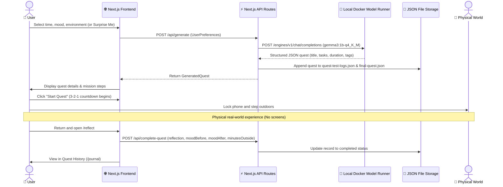

# SideQuest — Outside Quest

> **Less scrolling. More living.**  
> An AI that gives you a reason to put your phone down and go outside.

[](https://dev.to/challenges/hacktoberfest-week1-2026-10-05)
[-059669?style=flat-square)](https://huggingface.co/google/gemma-3-1b-it)
[-047857?style=flat-square)](https://docs.docker.com)
[-064e3b?style=flat-square)](https://nextjs.org)

---

## 🌱 What is SideQuest?

**SideQuest** (OutsideQuest) is an outdoor micro-adventure generator powered by a local, open-weight language model.

Instead of keeping you engaged in prolonged conversational dialogue, SideQuest is designed to do the opposite: take under a minute of your time, generate a small physical mission in your immediate environment, and tell you to put your phone away.

### Who it is for
* Anyone experiencing digital fatigue from extended screen sessions.
* Remote workers and students needing a structured reason to take a short break outdoors.
* Anyone who wants to step outside but gets stuck deciding where to go or what to do.

### The problem it addresses
Most outdoor and fitness applications demand continuous screen engagement — watching live maps, managing GPS routes, logging stats mid-walk, or photographing scenery for feeds. SideQuest requires zero interaction while you are outside.

### How it differs from a conventional AI chatbot
Traditional conversational models are measured by session length and message volume. SideQuest measures success by **how quickly you close the tab and step away from the device**.

---

## 🎯 The Problem

Modern daily routines make staying inside effortless and stepping outdoors surprisingly complicated:

* **Decision fatigue:** Deciding what to do during a brief 15-minute break often consumes the entire break.
* **The default to scrolling:** A quick break from work easily devolves into checking notifications and browsing feeds.
* **Overcomplicated expectations:** People assume spending time outside requires driving to a trail, buying gear, or committing hours of free time.
* **Lack of novelty:** Simply "going for a walk" around the same block can feel repetitive without a fresh observational lens.

SideQuest reframes ordinary surroundings — city sidewalks, neighborhood alleys, backyards, or local parks — into short, sensory missions that fit whatever time you actually have.

---

## 💡 The Idea

SideQuest operates on a simple, verified user flow:

```
[ Configure Context ] ➔ [ Local Model Generates Quest ] ➔ [ Start Countdown ] ➔ [ Leave Screen & Complete Outside ] ➔ [ Return & Reflect ]
```

1. **Input Parameters:** Select your available duration (15m, 30m, 45m, 60m, 120m, or custom minutes), current mood (11 presets or custom vibe), and physical environment (8 presets or custom spot).
2. **Local Inference:** A local Gemma 3 model generates a concise title, purpose, and ordered list of sensory observation tasks.
3. **Pocket the Device:** Tap **Start Quest** to trigger a 3-2-1 countdown, lock the screen, and step outside.
4. **Physical Experience:** Complete observational, listening, or noticing tasks in your immediate surroundings without touching a screen.
5. **Reflection & History:** Return when finished, record post-quest mood, calculate minutes spent outside, log personal notes, and view past quests in your journal.

---

## ✨ Features

* **Local Open-Weight AI Generation:** Runs Google's quantized `ai/gemma3:1b-q4_K_M` model locally via Docker Model Runner. Zero cloud API keys required.
* **Sensory, Anti-Screen Prompt Constraints:** System prompts explicitly instruct the model never to assign tasks involving phones, photography, internet searches, social media, or risky behavior.
* **Granular Time Budgeting:** Choose from 15m, 30m, 45m, 60m, 120m presets or enter any custom minute count.
* **11 Mood Presets + Custom Vibe:** Relax, Explore, Calm, Nature, Move, Create, Curious, Adventurous, Reflective, Anxious, Bored, or type any freeform text description.
* **8 Environment Settings + Custom Location:** Outdoors, Park, City/Urban, Home/Yard, Nature, Quiet Spot, Mixed, Anywhere, or type a custom setting.
* **Surprise Me Mode:** Generates a randomized quest with a single click for spontaneous outings.
* **Interactive Countdown & Running Timer:** Fullscreen modal featuring a 3-2-1 launch countdown followed by a live countdown timer with pause and resume capabilities.
* **Active Quest Limit Guard:** Enforces a maximum of **2 ongoing quests** simultaneously to prevent quest hoarding and encourage task completion.
* **Post-Quest Reflection Journal:** Automatically calculates minutes outside from start timestamps, pre-fills initial mood, records post-activity mood, and saves personal reflections.
* **Quest History Archive:** Filterable journal (All, Not started, Ongoing, Completed) with live countdown timer badges on ongoing quests and modal inspection for past quests.
* **Emerald & Dark Mode Interface:** Built with Tailwind CSS v4 and `next-themes` for high contrast and low eye strain.

---

## 🧭 How It Works



---

## 🤖 AI & Open-Weight AI

### Model Details
* **Model Name:** `ai/gemma3:1b-q4_K_M`
* **Architecture:** Google Gemma 3, 1-Billion parameter instruction-tuned variant, 4-bit Medium quantization (`Q4_K_M`).
* **Inference Runtime:** Docker Desktop Model Runner serving an OpenAI-compatible REST engine at `http://localhost:12434/engines/v1`.
* **Execution Location:** 100% on-device local execution.

### Why This Model?
* **Low Hardware Overhead:** The 1B quantized build requires less than 1.5 GB of RAM/VRAM, allowing it to run smoothly on standard development laptops without high-end dedicated GPUs.
* **Instruction Adherence:** Follows JSON formatting constraints reliably, returning clean parseable arrays of tasks without markdown wrappers or conversational filler.
* **Zero Cost & Offline Availability:** Operates without remote API billing, credit card requirements, or internet connectivity once the model weights are loaded.

### Why Open-Weight Matters
Using an open-weight model ensures that personal notes, emotional states before and after activities, and location preferences remain strictly on the user's local machine.

---

## 🌳 Touch Grass: Why This Fits the Challenge

Built for **Hacktoberfest 2026 — Week 1 Challenge (“Touch Grass”)**, SideQuest approaches the prompt literally:

1. **The screen is the shortest part of the experience:** Configuring and launching a quest takes under 60 seconds.
2. **Explicit anti-phone prompt design:** The system prompt strictly prohibits photo-taking, video recording, or app checks, forcing the user to rely purely on observation and physical senses.
3. **Offline activity:** The actual value of the software happens while the user's phone is locked in their pocket.
4. **Intentional return:** The reflection step gives closure to the outdoor session without pulling the user back into an algorithmic feed.

---

## 🏗️ Architecture

SideQuest uses a monolithic Next.js architecture with localized service boundaries:

```
┌────────────────────────────────────────────────────────┐
│                   Next.js 16 (App Router)              │
│                                                        │
│  Client Layer (React 19, Tailwind CSS v4, next-themes) │
│  ├── Landing Page (/)                                  │
│  ├── Quest Creator (/start)                            │
│  ├── Quest View (/quest)                               │
│  ├── Reflection Form (/reflect)                        │
│  └── History Journal (/journal)                        │
│                                                        │
│  Server Layer (Next.js Route Handlers)                 │
│  ├── POST /api/generate                                │
│  ├── GET  /api/generate                                │
│  ├── GET  /api/latest-quest                            │
│  ├── POST /api/update-quest-progress                   │
│  └── POST /api/complete-quest                          │
└───────────────┬────────────────────────┬───────────────┘
                │                        │
       HTTP (OpenAI-compatible)     File I/O (Async fs)
                │                        │
┌───────────────▼────────────────┐ ┌─────▼───────────────┐
│   Docker Desktop Model Runner  │ │   Local File Storage│
│   http://localhost:12434       │ │                     │
│   ai/gemma3:1b-q4_K_M          │ │ quest-test-logs.json│
│   (Local CPU / GPU Engine)     │ │ final-quest.json    │
└────────────────────────────────┘ └─────────────────────┘
```

---

## 🛠️ Tech Stack

| Layer | Technology | Purpose |
|:---|:---|:---|
| **Frontend Framework** | Next.js 16.3.8 (App Router) | Application routing, server rendering, and layout structure |
| **UI Library** | React 19.2.8 | Interactive interface components and state handling |
| **Styling** | Tailwind CSS v4 | Utility styling, responsive design, dark/light modes |
| **Theming** | `next-themes` v0.4.6 | Theme persistence across page reloads |
| **AI Model** | Google Gemma 3 1B (`ai/gemma3:1b-q4_K_M`) | Open-weight instruction-tuned language model |
| **AI Serving Engine** | Docker Desktop Model Runner | Local engine serving OpenAI-compatible API at port 12434 |
| **Backend API** | Next.js API Routes (`app/api/*`) | Prompt assembling, validation, and JSON data transformations |
| **Storage** | Local JSON files (`quest-test-logs.json`, `final-quest.json`) | Lightweight local persistence for quests and reflections |
| **Runtime & Package Manager** | Bun v1.2.8 / Node.js v20+ | Package management and local development runtime |

---

## 🚀 Getting Started

### Prerequisites
* [Bun](https://bun.sh/) (v1.2+) or [Node.js](https://nodejs.org/) (v20+)
* [Docker Desktop](https://www.docker.com/) with **Model Runner** enabled (or any local engine serving `ai/gemma3:1b-q4_K_M` over an OpenAI-compatible endpoint at port 12434)

### 1. Clone the Repository
```bash
git clone <YOUR_GITHUB_REPOSITORY_URL>
cd outside-quest
```

*(If working from the upstream fork: `https://github.com/NegiSushant/OutsideQuest.git`)*

### 2. Install Dependencies
```bash
# Using Bun (recommended)
bun install

# Or using npm
npm install
```

### 3. Configure Environment Variables
Copy `.env.example` to `.env`:
```bash
cp .env.example .env
```

Verify that `.env` points to your local engine:
```env
BASE_URL=http://localhost:12434/engines/v1
MODEL=ai/gemma3:1b-q4_K_M
```

### 4. Pull and Start the AI Model
Ensure Docker Desktop is running with Model Runner enabled, then pull the model:
```bash
docker model pull ai/gemma3:1b-q4_K_M
```
Confirm the local engine is listening on `http://localhost:12434/engines/v1`.

### 5. Run the Application
```bash
# Using Bun
bun run dev

# Or using npm
npm run dev
```

Open [http://localhost:3000](http://localhost:3000) in your browser.

---

## ⚙️ Configuration

| Variable | Required | Default Value | Description |
|:---|:---|:---|:---|
| `BASE_URL` | No | `http://localhost:12434/engines/v1` | Base URL of the local OpenAI-compatible inference engine |
| `MODEL` | No | `ai/gemma3:1b-q4_K_M` | Identifier of the model loaded in the local engine |

*Note: No external API keys or secrets are required to run the application.*

---

## 🧪 Example Usage

### Input (User Preferences)
```json
{
  "availableTime": 15,
  "mood": "relax",
  "environment": "park",
  "isSurprise": false,
  "notes": "Keep it quiet, i have knee problem"
}
```

### Output (Model-Generated Quest)
```json
{
  "id": "afeab23e-cf49-43df-bb06-a08536647f66",
  "title": "Stroll Through the Park's Hidden Corner",
  "duration": 15,
  "goal": "Find a serene spot to sit and observe the surroundings",
  "tasks": [
    {
      "id": "task-1",
      "description": "Walk slowly to a quiet area of the park, avoiding main paths"
    },
    {
      "id": "task-2",
      "description": "Find a bench or a tree with a flat surface to sit on, and sit down"
    },
    {
      "id": "task-3",
      "description": "Observe the types of leaves and flowers around you, noticing any changes in the season"
    },
    {
      "id": "task-4",
      "description": "Listen to the sounds of nature, focusing on the quietest sounds, such as the rustling of leaves or the chirping of birds"
    }
  ],
  "tags": ["relaxation", "nature", "observation"],
  "generatedAt": "2026-10-07T10:57:08.874Z",
  "status": "completed"
}
```

---

## 🌱 Real-World Usage

SideQuest has been tested with real outdoor micro-adventures during development:

* **Observation tasks in parks:** Testing sensory tasks (leaf texture comparison, sound identification) demonstrated that 15-minute quests reliably reset mental focus.
* **Mobility accommodations:** Testing custom notes ("knee problem", "quiet surroundings") confirmed that Gemma 3 respects physical limitations by generating sit-and-observe tasks rather than strenuous movement.
* **All test records:** Persisted in `quest-test-logs.json`, documenting real runs across different environments and mood settings.

---

## 🔐 Privacy

* **Zero telemetry:** No external analytics, user tracking, or third-party cookies are used.
* **Zero cloud transmission:** Quest prompts, personal notes, and reflections are sent solely to `http://localhost:12434` on your local loopback interface.
* **Local file storage:** Quests and journal entries are written directly to local JSON files on your hard drive. No remote database is contacted.

---

## ⚠️ Limitations

* **Local Engine Dependency:** The application requires Docker Desktop Model Runner (or a compatible local OpenAI-format runner) to be running. If the engine is stopped, generation will fail.
* **1B Model Nuance:** While `gemma3:1b` is fast and adheres strictly to JSON schemas, small models can occasionally produce repetitive wording if prompts are left very sparse.
* **Concurrent Storage:** Flat JSON file storage is built for single-user local usage; it is not suited for high-concurrency multi-user server environments.
* **Browser Timer Behavior:** The audio/visual countdown timer runs in the active browser tab. While elapsed time is recalculated using timestamps if you navigate away, real-time chimes require an open tab.
* **Common Sense Required:** Quests are generated by an AI model. Users should always practice situational awareness, follow local laws, and prioritize personal safety when exploring outdoors.

---

## 🔮 Future Improvements

* [ ] **Audio Chimes:** Optional bell sound when the quest timer completes.
* [ ] **Progressive Web App (PWA):** Offline service worker support for home-screen installation on mobile.
* [ ] **Weather Context Awareness:** Optional local weather parameter to suggest indoor-adjacent or rain-appropriate observational tasks.
* [ ] **Hand-Drawn Journal Notes:** Local canvas scratchpad for quick sketches of plants or landmarks noticed during a quest.
* [ ] **Weekly Quest Streaks:** Lightweight offline counter celebrating days with at least one completed outdoor quest.

---

## 🎥 Demo

* **Demo Video:** `<DEMO_VIDEO_URL>`
* **Devfolio Submission:** [https://devfolio.co/](https://devfolio.co/)

---

## 📸 Screenshots

<!-- Add screenshots here when available -->
* **Quest Generator:** `<SCREENSHOT_URL>`
* **Active Quest Timer:** `<SCREENSHOT_URL>`
* **Reflection Journal:** `<SCREENSHOT_URL>`

---

## 🧑‍💻 Project Structure

```
outside-quest/
├── src/
│   ├── app/
│   │   ├── api/
│   │   │   ├── complete-quest/         # POST: Save reflection & mark quest completed
│   │   │   ├── generate/               # POST: Query local Gemma 3 model; GET: Retrieve history
│   │   │   ├── latest-quest/           # GET: Fetch latest or specific quest by ID
│   │   │   └── update-quest-progress/  # POST: Update ongoing status, pause time, remaining seconds
│   │   ├── journal/                    # Quest history archive with filtering and detail modal
│   │   ├── quest/                      # Active quest view with Start/Resume triggers
│   │   ├── reflect/                    # Full-context reflection journal form
│   │   ├── start/                      # Quest customization form (time, mood, environment)
│   │   ├── start-quest/                # Standalone timer countdown page
│   │   ├── globals.css                 # Global styling and Tailwind CSS v4 directives
│   │   ├── layout.tsx                  # Root layout with ThemeProvider, Navbar, and Footer
│   │   └── page.tsx                    # Landing page explaining the philosophy and loop
│   ├── components/
│   │   ├── Footer.tsx                  # Project metadata and local AI badge
│   │   ├── Loader.tsx                  # Minimalist loading spinner
│   │   ├── Navbar.tsx                  # Navigation bar and dark/light mode toggle
│   │   ├── QuestGeneratingView.tsx     # Animated generation progress view
│   │   ├── StartQuest.tsx              # Interactive 3-2-1 countdown & active timer modal
│   │   └── ThemeProvider.tsx           # Dark mode persistence wrapper (next-themes)
│   └── lib/
│       ├── ai_client.ts                # OpenAI-compatible client targeting local Docker Model Runner
│       ├── config.ts                   # Environment configuration (BASE_URL, MODEL)
│       ├── prompts.ts                  # Anti-screen system prompts for sensory tasks
│       ├── tempDb.ts                   # Persistent completed quest JSON logging utility
│       └── types.ts                    # Shared TypeScript interfaces (Mood, Environment, Quest)
├── final-quest.json                    # Persistent store for completed quest snapshots
├── quest-test-logs.json                # Local JSON database for quest sessions and reflections
├── .env.example                        # Template for local engine configuration
├── package.json                        # Project dependencies and npm/bun scripts
└── README.md                           # Project documentation
```

---

## 🤝 Contributing

Contributions are welcome! To contribute:

1. Fork the repository
2. Create a feature branch (`git checkout -b feature/improvement`)
3. Commit your changes (`git commit -m 'Add improvement'`)
4. Push to your branch (`git push origin feature/improvement`)
5. Open a Pull Request

---

## 📄 License

License has not yet been specified.

---

## 🏆 Hacktoberfest 2026

Built for **Hacktoberfest 2026 — DEV Community Week 1 Challenge (“Touch Grass”)**.  
Challenge details: [https://dev.to/challenges/hacktoberfest-week1-2026-10-05](https://dev.to/challenges/hacktoberfest-week1-2026-10-05)

---

## 🙌 Acknowledgements

* [Google Gemma 3](https://huggingface.co/google/gemma-3-1b-it) — Open-weight model family.
* [Docker Desktop Model Runner](https://docs.docker.com/) — Local model inference engine.
* [Next.js](https://nextjs.org/) by Vercel — Full-stack React framework.
* [Tailwind CSS](https://tailwindcss.com/) — Utility-first CSS framework.
* [Bun](https://bun.sh/) — Fast all-in-one JavaScript runtime & toolkit.
* [DEV Community](https://dev.to/) — Hacktoberfest 2026 organization and challenge host.
