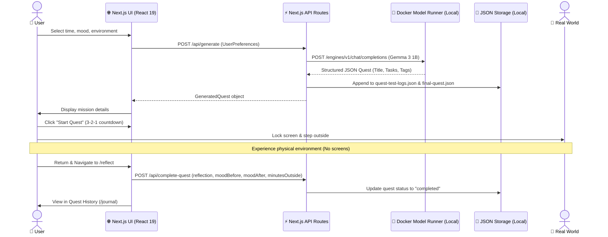

# SideQuest — Outside Quest

> **Less scrolling. More living.**  
> An open-weight AI micro-adventure generator that gives you a reason to put your phone down and go outside.

[](https://dev.to)
[-059669?style=flat-square)](https://huggingface.co/google/gemma-3-1b-it)
[-047857?style=flat-square)](https://docs.docker.com)
[-064e3b?style=flat-square)](https://nextjs.org)

---

## 🌱 What is SideQuest?

**SideQuest** (OutsideQuest) is a minimalist, privacy-first web application designed to break the digital dopamine loop. Instead of engaging you in endless chatbot dialogue, SideQuest uses a **local, open-weight AI model** to generate quick, personalized real-world missions that require you to step outdoors.

### Who is it for?
Anyone experiencing digital fatigue — remote workers stuck at desks, students trapped in infinite social media feeds, or anyone who wants to take a mindful break outdoors but doesn't know where to start or what to do.

### What problem does it solve?
Most outdoor apps demand continuous attention: GPS tracking, live maps, step battles, or photo sharing. SideQuest does the opposite. You spend **under 60 seconds** setting your time and mood, receive an actionable sensory mission, pocket your phone, and step into the physical world.

### How it differs from a traditional AI assistant
Traditional AI assistants are built to maximize session duration and keep you looking at the screen. **In SideQuest, the primary metric of success is time spent away from the screen.**

---

## 🎯 The Problem

Modern technology has made staying inside frictionless and stepping outside surprisingly difficult:

* **Analysis Paralysis:** When given a 20-minute break, deciding what to do often consumes the break itself.
* **The Dopamine Loop:** Taking a "break" frequently turns into 30 minutes of scrolling notifications.
* **Generic Suggestions:** Generic advice ("take a walk") feels mundane and uninspiring.
* **Time Constraints:** People assume outdoor activities require hours of preparation, trail hiking gear, or driving to a nature reserve.

SideQuest turns ordinary surroundings — whether a city sidewalk, neighborhood corner, backyard, or local park — into a structured micro-quest tailored exactly to the minutes you have available.

---

## 💡 The Idea & User Journey

SideQuest follows a strict, distraction-free loop:

```
[ Set Preferences ] ➔ [ Local AI Generates Quest ] ➔ [ Lock Screen & Step Outside ] ➔ [ Real-World Mission ] ➔ [ Return & Reflect ]
```

1. **Input Your Context:** Choose your available time (15m to 2h, or custom), current mood (11 distinct vibes or custom text), and environment (park, urban, backyard, quiet spot, etc.).
2. **AI Synthesizes Quest:** A local Gemma 3 model generates a sensory, phone-free quest with 2–4 concrete steps.
3. **Lock & Step Out:** Press **Start Quest**, watch the 3-2-1 countdown, lock your device, and go outside.
4. **Complete in the Real World:** Observe, notice, and interact with your physical surroundings without screens.
5. **Record Your Reflection:** When you return, log your post-quest mood, record minutes spent outside, and jot down what you noticed.

---

## ✨ Features

* **🧠 100% Local Open-Weight AI Inference:** Powered by Google's `gemma3:1b-q4_K_M` running locally via Docker Desktop Model Runner. Zero cloud API calls, zero tracking, and no external token costs.
* **⏱️ Strict Time-Bounded Quests:** Presets for 15m, 30m, 45m, 60m, 120m, or exact custom minute inputs. Quests are engineered to fit your available window.
* **🧘 11 Curated Moods + Custom Vibes:** Relax, Explore, Calm, Nature, Move, Create, Curious, Adventurous, Reflective, Anxious, Bored, or type any freeform vibe.
* **🌲 8 Environment Contexts:** Outdoors, Park, City/Urban, Home/Yard, Nature, Quiet Spot, Mixed, or Anywhere.
* **🎲 Surprise Me Mode:** Instant one-click generation with randomized constraints for spontaneous adventurers.
* **📵 Anti-Screen Prompt Engineering:** System prompts strictly forbid phone usage, photography, social media, app checks, or dangerous activities. Missions focus purely on sensory awareness, mindfulness, and observation.
* **⏳ Live Quest Timer & Active Tracker:** Integrated 3-2-1 countdown modal followed by a clean countdown timer with pause, resume, and completion detection.
* **🔒 Concurrency Guard (Max 2 Ongoing Quests):** Enforces focus by preventing users from hoarding active quests. You can have at most 2 quests in progress simultaneously.
* **📝 Reflection & Feedback Journal:** Capture how your mood shifted before and after the quest, automatically compute minutes spent outside, and save personal notes.
* **📜 Complete Quest History:** Full archive of past quests with real-time status badges (`not_started`, `ongoing`, `completed`), live countdown timers for running quests, and detailed modals displaying full quest tasks and saved reflections.
* **🌓 Emerald & Dark Mode Design:** Fully responsive theme using Tailwind CSS v4 and Next-themes, tuned for low eye strain.

---

## 🧭 How It Works



---

## 🤖 AI & Open-Weight AI

### Exact Model
* **Model:** `ai/gemma3:1b-q4_K_M` (Google Gemma 3, 1-Billion Parameter Instruction-Tuned, 4-bit Medium Quantization).
* **Serving Runtime:** Docker Desktop Model Runner exposing an OpenAI-compatible REST endpoint on `http://localhost:12434/engines/v1`.

### Why This Model?
1. **Ultra-Low Memory Footprint:** Running a 1B Q4 model consumes less than 1.5 GB of RAM/VRAM, making it capable of running on modest laptops without specialized GPUs.
2. **Deterministic Structured Output:** Gemma 3 follows strict JSON schema requirements reliably, producing machine-parsable task arrays without extraneous markdown chatter.
3. **Low Latency:** Local inference generates quests in seconds without round-trip latency to remote servers.

### Why Open-Weight Matters Here
* **True Privacy for Personal Reflections:** Your emotional states, freeform reflections, daily schedules, and locations never leave your machine.
* **No Cloud Dependency or Paywalls:** No credit card, no API keys, and no rate limits.
* **Offline Resilience:** Once the model bundle is downloaded, the entire application works offline.

---

## 🌳 Touch Grass: Why This Fits the Challenge

SideQuest was built specifically for **Hacktoberfest 2026 — Week 1 Challenge (“Touch Grass”)**.

The theme asks developers to use open-source and open-weight AI to encourage meaningful, real-world human experiences away from screens.

SideQuest embraces this theme directly:

| Conventional AI Chatbot | SideQuest |
| :--- | :--- |
| Encourages prolonged conversations | Generates an activity in < 30 seconds |
| Answers queries with screen text | Sends you into your physical surroundings |
| Optimizes for session retention | Optimizes for time spent offline |
| Prompts for photos / uploads | Prompt forbids checking phones or taking photos |
| Cloud-dependent tracking | 100% local, zero-tracking, private |

---

## 🏗️ Architecture

```
outside-quest/
├── src/
│   ├── app/
│   │   ├── api/
│   │   │   ├── complete-quest/       # POST: Save reflection & mark quest completed
│   │   │   ├── generate/             # POST: Invoke Gemma 3; GET: Fetch quest history
│   │   │   ├── latest-quest/         # GET: Retrieve latest quest or specific quest by ID
│   │   │   └── update-quest-progress/# POST: Update ongoing status, pause time, timer
│   │   ├── journal/                  # Quest history archive with live filter & modal
│   │   ├── quest/                    # Generated quest view with Start/Resume actions
│   │   ├── reflect/                  # Full-context reflection form with mood tracking
│   │   ├── start/                    # Quest generator configuration form
│   │   ├── globals.css               # Tailwind CSS v4 design tokens
│   │   ├── layout.tsx                # App root layout with Navbar & Footer
│   │   └── page.tsx                  # Landing page & philosophy
│   ├── components/
│   │   ├── Footer.tsx                # Project links & local AI indicator
│   │   ├── Navbar.tsx                # Navigation bar with dark mode toggle
│   │   ├── QuestGeneratingView.tsx   # Dynamic generation loading state
│   │   ├── StartQuest.tsx            # Fullscreen 3-2-1 countdown & active timer modal
│   │   └── ThemeProvider.tsx         # Next-themes wrapper
│   └── lib/
│       ├── ai_client.ts              # Local engine client (configured to Docker Model Runner)
│       ├── config.ts                 # Base URL and Model configuration
│       ├── prompts.ts                # Structured system prompt enforcing sensory tasks
│       ├── tempDb.ts                 # JSON persistence helper
│       └── types.ts                  # Shared TypeScript interfaces (Mood, Environment, Quest)
├── quest-test-logs.json              # Local JSON log for quests, progress, and reflections
├── final-quest.json                  # Persistent store for completed quest records
└── package.json                      # Project dependencies & scripts
```

---

## 🛠️ Tech Stack

| Layer | Technology | Purpose |
| :--- | :--- | :--- |
| **Frontend Framework** | [Next.js 16](https://nextjs.org) (App Router) | Server & client component architecture |
| **UI Library** | [React 19](https://react.dev) | Declarative UI and state management |
| **Styling** | [Tailwind CSS v4](https://tailwindcss.com) | Responsive utility-first styling with emerald accents |
| **Theming** | [next-themes](https://github.com/pacocoursey/next-themes) | Dark & light mode persistence |
| **AI Model** | Google Gemma 3 1B (`ai/gemma3:1b-q4_K_M`) | Open-weight instruction-tuned LLM |
| **Local AI Engine** | Docker Desktop Model Runner | Serves local OpenAI-compatible API at port `12434` |
| **Backend API** | Next.js Route Handlers (`app/api/*`) | Server-side prompt formatting, validation, persistence |
| **Storage** | File System JSON (`quest-test-logs.json`) | Lightweight, zero-config local persistence |
| **Runtime & Tooling** | [Bun](https://bun.sh) / Node.js 20+ | Package management and script execution |

---

## 🚀 Getting Started

### Prerequisites

1. **Bun** (v1.2+) or **Node.js** (v20+)
2. **Docker Desktop** with the **Model Runner** feature enabled (or any local engine serving `ai/gemma3:1b-q4_K_M` via an OpenAI-compatible endpoint).

### 1. Clone the Repository

```bash
git clone https://github.com/NegiSushant/OutsideQuest.git
cd OutsideQuest
```

### 2. Install Dependencies

Using Bun (recommended):
```bash
bun install
```

Or using npm:
```bash
npm install
```

### 3. Configure Environment Variables

Copy `.env.example` to `.env`:

```bash
cp .env.example .env
```

Ensure `.env` matches your local model runner endpoint:

```env
BASE_URL=http://localhost:12434/engines/v1
MODEL=ai/gemma3:1b-q4_K_M
```

### 4. Ensure Local Model Runner is Running

Pull and run the Gemma 3 model in your local Docker Model Runner:

```bash
# Example using Docker Model Runner CLI or Docker Desktop UI:
docker model pull ai/gemma3:1b-q4_K_M
```

Verify that `http://localhost:12434/engines/v1` is reachable.

### 5. Start the Development Server

```bash
bun run dev
# or: npm run dev
```

Open [http://localhost:3000](http://localhost:3000) in your browser.

---

## ⚙️ Environment Variables

| Variable | Default Value | Description |
| :--- | :--- | :--- |
| `BASE_URL` | `http://localhost:12434/engines/v1` | URL of the local OpenAI-compatible inference engine |
| `MODEL` | `ai/gemma3:1b-q4_K_M` | Identifier of the local open-weight model |

---

## 📡 API Overview

| Method | Endpoint | Description |
| :--- | :--- | :--- |
| `POST` | `/api/generate` | Generates a new structured quest using the local Gemma 3 model based on `UserPreferences`. |
| `GET` | `/api/generate` | Returns all recorded quests from `quest-test-logs.json` in reverse chronological order. |
| `GET` | `/api/latest-quest` | Fetches the most recently generated quest, or a specific quest when queried with `?id=<questId>`. |
| `POST` | `/api/update-quest-progress` | Updates the live progress of an active quest (`status`, `remainingSeconds`, `lastPausedAt`). |
| `POST` | `/api/complete-quest` | Records post-quest reflections, mood shifts, and sets the quest to `completed`. |

---

## ⚠️ Limitations

* **Local Engine Requirement:** The app relies on a locally running Docker Model Runner (or compatible local LLM engine). If the engine is stopped, quest generation will fail with a connection error.
* **1B Parameter Model Tradeoffs:** `gemma3:1b` is optimized for speed and low memory usage. While highly capable of producing structured JSON quests, it may occasionally need precise inputs for unusual custom locations.
* **Single-Node File Storage:** Data is stored in local JSON files (`quest-test-logs.json`). This is ideal for personal, private local usage, but not meant for high-concurrency multi-tenant server deployments.
* **Browser Tab Lifecycle:** While the quest timer calculates elapsed time correctly upon return via timestamps, audio/visual countdowns operate in the active tab.

---

## 🔮 Future Ideas

* [ ] **Audio Chime:** Subtle bell sound when the countdown timer hits zero.
* [ ] **Progressive Web App (PWA):** Installable offline home screen app with service workers.
* [ ] **Offline Map Scratchpad:** Optional local canvas to sketch memorable landmarks noticed during quests.
* [ ] **Seasonal Quests:** Dynamic environmental awareness adjustments (rain, autumn leaves, snow, heat).
* [ ] **Multi-Day Quest Chains:** Cumulative micro-adventures that build local environmental familiarity over a week.

---

## 🤝 Contributing

Contributions are welcome! Please feel free to open an issue or submit a pull request:

1. Fork the Project
2. Create your Feature Branch (`git checkout -b feature/amazing-feature`)
3. Commit your Changes (`git commit -m 'Add some amazing feature'`)
4. Push to the Branch (`git push origin feature/amazing-feature`)
5. Open a Pull Request

---

## 📄 License

This repository does not currently include an explicit open-source license file. We recommend adding the [MIT License](https://opensource.org/licenses/MIT) for permissive open-source usage.

---

## 🏆 Hacktoberfest

Built for **Hacktoberfest 2026 — DEV Community Week 1 Challenge (“Touch Grass”)**.
